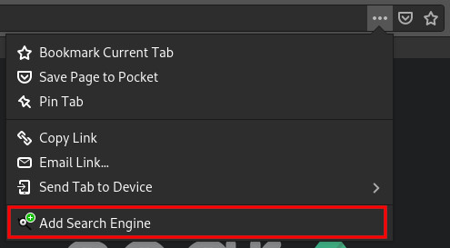
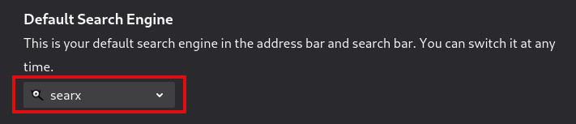
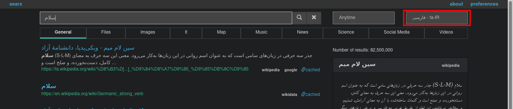
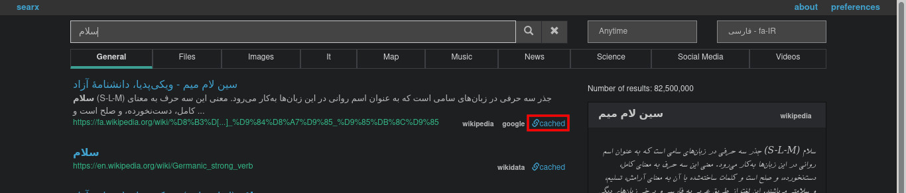

**[searx](https://searx.me/)** یک موتور فراجست و جوگر (metasearch engine) است که با [پروانه AGPL](https://www.gnu.org/licenses/agpl-3.0.en.html) منتشر شده و با زبان پایتون نوشته شده است. searx نتایج را از بیش از ۷۰ سرویس جست و جو جمع آوری می کند و به کاربر نمایش می دهد. اطلاعاتی از کاربران ذخیره نمی شود و حتی برای افزایش ناشناس بودن، می توان از تور در کنار آن استفاده کرد. در این نوشتار، به بررسی searx به عنوان راهکاری برای حفظ حریم خصوصی و افزایش امنیت می پردازم.
## گوگل و حریم خصوصی
از زمان تولد موتور جست و جوی گوگل ۲۴ سال می گذرد. در این سال ها این شرکت بزرگ تغییرات زیادی کرده ولی چیزی که همه بر آن اتفاق نظر دارند، عدم رعایت حریم خصوصی کاربر توسط این شرکت جهانی است. سرویس های مختلف گوگل، اطلاعات و داده های زیادی را از کاربران جمع آوری می کنند. فروش این اطلاعات به آژانس های آماری (و احتمالا دولت ها) یا استفاده از آن ها برای تحلیل گرایش ها و علایق کاربران و نمایش تبلیغات، وسیله ای برای کسب درآمد گوگل محسوب می شود. گوگل جست و جوهای شما را تحلیل می کند، ایمیل هایتان را می خواند، به فایل های شما دسترسی دارد و به طور مداوم اطلاعات موقعیت شما را از طریق سرویس های پلی در اندروید دریافت می کند. نگرانی در مورد اقدامات گوگل و زیرپاگذاشتن حقوق کاربران و حریم خصوصی باعث شکل گیری [حرکت degoogle](https://en.wikipedia.org/wiki/DeGoogle) شد.

در این حرکت، سرویس ها و اپلیکیشن های جایگزین برای گوگل معرفی شد تا استفاده از محصولات گوگل، در زندگی ما کم شود یا به طور کامل کنار رود. شاید با خود بگویید از کجا معلوم این سرویس های جایگزین به حریم خصوصی کاربر احترام می گذارند؟! در مورد بعضی سرویس های جایگزین این حرف درستی است اما حتی با این وجود، وقتی اطلاعات کاربر، در چند شرکت مختلف و کوچک پخش شده، بهتر از این است که تمام اطلاعات در اختیار شرکتی بزرگ مثل گوگل باشد. صحبت در مورد حرکت degoogle طولانی است و از حوصله این نوشتار خارج است. این مقاله صرفا روی امنیت و حریم خصوصی در موتورهای جست و جو تمرکز دارد.
## داک داک گو؛ جایگزینی برای گوگل
در سال ۲۰۰۸ موتور جست و جوی **[داک داک گو](https://duckduckgo.com/)** با محوریت حریم خصوصی به عنوان جایگزینی برای گوگل معرفی شد. آیا داک داک گو اطلاعاتی جمع آوری نمی کند؟ داک داک گو اطلاعات را ذخیره می کند ولی این داده ها مربوط به جست و جو است و برای بهبود این موتور استفاده می شود و داده های کاربر ذخیره نمی شود.

داک داک گو جایگزین مناسبی برای گوگل است. به حریم خصوصی احترام می گذارد و تا حد زیادی امنیت کاربر را حفظ می کند. با تمام این حرف ها، هنوز مشکلات کوچکی در مورد این موتور جست و جو وجود دارد. هسته داک داک گو تجاری و بسته است و برای کسی که به آزاد و متن باز بودن سرویس هایی که استفاده می کند اهمیت می دهد، می تواند نگران کننده باشد. همچنین نتایج جست و جوها در تاریخچه مرورگر شما ذخیره می شود و هر کسی که به سیستم شما دسترسی دارد، می تواند آن ها را مشاهده کند. اگر شما هم نگران این موضوعات هستید، یک راه حل خوب وجود دارد: شما می توانید موتور جست و جوی خود را به طور محلی (لوکال) روی سیستم خودتان نصب کنید. این جاست که موتور فراجست و جوی searx به میدان می آید.
## موتور فراجست و جوی searx
کد searx آزاد است. هر کسی می تواند کد را دانلود کند و یک نمونه (instance) از searx راه اندازی کند. تعداد زیادی [نمونه searx](https://searx.space/) در سرتاسر اینترنت وجود دارد. می توانید یکی از این نمونه ها را انتخاب کنید و از آن استفاده کنید. اما اینکه می توان به این نمونه ها اعتماد کرد یا نه به خود کاربر بستگی دارد. امن ترین راه این است که خودتان یک نمونه راه اندازی کنید. هزینه خرید سرور بالاست و برای یک کاربر عادی ارزشی ندارد، برای ساخت یک نمونه خصوصی از searx، چنین هزینه ای را پرداخت کند. اما آیا برای استفاده از searx واقعا به یک سرور نیاز است؟! شما می توانید searx را به طور محلی روی سیستم خودتان راه اندازی کنید و در نتیجه تمام تنظمیات و پیکربندی آن در اختیار شما است. استفاده از searx به صورت محلی بیشترین میزان حریم خصوصی را برای شما ایجاد می کند.

در سایت رسمی searx، روش نصب آن روی توزیع های مختلف لینوکس آموزش داده شده است. در این نوشتار قصد ندارم آموزش نصب و راه اندازی searx را براساس سایت رسمی بدهم. در مخازن رسمی دبیان searx وجود دارد و راحت ترین راه برای راه اندازی آن استفاده از همین پکیج ها در مخازن رسمی است. هر چند نگارش searx در مخازن قدیمی تر است اما برای یک کاربر عادی تفاوت چندانی ندارد و این روش به مراتب ساده تر از روش رسمی است. اگر از توزیعی برپایه دبیان استفاده می کنید، براساس همین آموزش searx را نصب کنید. در غیر این صورت از روشی که در سایت رسمی [گفته شده](https://searx.github.io/searx/)، استفاده کنید.
## نصب searx در دبیان
### searx در وب سرور فلسک
برای نصب searx در دبیان از دستورات زیر استفاده کنید:
```
sudo apt update
sudo apt upgrade
sudo apt install searx
```
برای استفاده از searx لازم است فایل پیکربندی و تنظیمات آن را اضافه کنید. برای این کار از دستورات زیر را وارد کنید:
```
sudo mkdir /etc/searx
sudo cp /usr/share/doc/searx/examples/settings.yml /etc/searx/
sed -i -e "s/ultrasecretkey/$(openssl rand -hex 16)/g" /etc/searx/settings.yml
```
حال با دستور زیر می توانید searx را اجرا کنید:
```
searx-run
```
تمام شد. موتور فراجست و جوی searx در آدرس localhost:8888 در اختیار شماست. اجرا کردن دستور searx-run با هربار روشن کردن سیستم، کار جالبی نیست. بنابراین می توانید این دستور را در قسمت autostart سیستم عامل خود قرار دهید.

دستور searx-run، وب سرور مخصوص توسعه فلسک را اجرا می کند. در ادامه این نوشتار به نصب searx روی وب سرور nginx می پردازم.
### searx در وب سرور nginx
بعد از این که تمام مراحل بالا را طی کردید، نیاز است nginx و uwsgi را نصب کنید:
```
sudo apt install nginx-full uwsgi uwsgi-plugin-python3
```
در ادامه دستورات زیر را برای پیکربندی nginx اجرا کنید:
```
sudo cp /usr/share/doc/searx/examples/nginx/sites-available/searx /etc/nginx/sites-available
sudo ln -s ../sites-available/searx /etc/nginx/sites-enabled/searx
```
وارد فایل `/etc/nginx/sites-available` شوید و به جای FIXME بنویسید: localhost و پورت را هم به 81 تغییر دهید.

و برای پیکربندی uwsgi دستورات زیر را وارد کنید:
```
sudo cp /usr/share/doc/searx/examples/uwsgi/apps-available/searx.ini /etc/uwsgi/apps-available
sudo ln -s ../apps-available/searx.ini /etc/uwsgi/apps-enabled/searx.ini
```
سرویس های nginx و uwsgi را ری استارت کنید:
```
sudo systemctl restart nginx
sudo systemctl restart uwsgi
```
تبریک می گویم. از این پس، بدون هیج دستوری در مسیر localhost:81 به searx دسترسی دارید.
## پیکربندی searx
برای تغییر تنظیمات پیشفرض searx، وارد فایل `/etc/searx/settings.yml` شوید و تغییرات مورد نظر خود را وارد کنید. در این جا به چند مورد از تنظیمات مهم اشاره شده است:
- autocomplete: با قراردادن نام موتور جست و جوی مورد نظر خود در این قسمت، امکان تکمیل خودکار نتایج را فعال کنید. به عنوان مثال مقدار "google" را قرار دهید.
- default_lang: زبان پیشفرض جست و جو را تعیین می کند. در صورت خالی گذاشتن، از تنظیمات مرورگر برای مشخص کردن زبان پیشفرض جست و جو استفاده می شود. توجه داشته باشید searx امکان تشخیص خودکار زبان را برپایه واژه هایی که جست و جو می کنید ندارد.
- method: به طور پیشفرض searx از متد POST برای ارسال اطلاعات استفاده می کند. متد POST امن تر است و اطلاعات جست و جوی شما در تاریخچه مرورگر ذخیره نمی شود. اگر چنین ویژگی را نمی خواهید، مقدار آن را "GET" قرار دهید.
- default\_theme: در این قسمت می توانید پوسته searx را انتخاب کنید. پوسته های قابل استفاده: legacy، oscar، simple، courgette، pix-art
- default\_locale: در این قسمت زبان محیط کاربری searx را تغییر می دهید. در صورت خالی گذاشتن این بخش، زبان براساس مرورگر تعیین می شود.
- oscar\_style: اگر پوسته های تاریک را ترجیح می دهید و از پوسته oscar استفاده می کنید مقدار این بخش را به logicodev-dark تغییر دهید.
- results\_on\_new\_tab: این قسمت را از حالت کامنت خارج کنید و مقدار آن را برابر True قرار دهید. در این صورت با کلیک روی نتایج، سایت ها در تب جدید باز می شوند.

بعد از هر بار تغییر تنظیمات برای دیدن نتایج، سرویس uwsgi را ری استارت کنید:
```
sudo systemctl restart uwsgi
```
تغییر این فایل پیکربندی، تنظیمات پیشفرض searx را تغییر می دهد. همچنین شما می توانید تنظیمات را در قسمت preferences در آدرس localhost:81/preferences تغییر دهید. در روش دوم، تنظیمات در سمت سرور، تغییری نمی کند و تغییرات در کوکی در مرورگر شما ذخیره می شود.
## اضافه کردن searx به فایرفاکس
اگر بخواهید از searx به عنوان موتور جست و جوی اصلی خود استفاده کنید، وارد کردن آدرس آن برای هر بار جست و جو کار مشکلی است. بنابراین در قدم بعدی لازم است تا searx را به عنوان موتور جست و جوی پیشفرض فایرفاکس قرار دهید. فایرفاکس به صورت پیشفرض از searx پشتیبانی نمی کند. بنابراین برای این کار باید آن را به لیست موتورهای جست و جوی فایرفاکس اضافه کنید. این کار هیچ نیازی به افزونه مرورگر ندارد. کافی است مراحل زیر را طی کنید:

ابتدا وارد آدرس localhost:81 شوید و مانند تصویر زیر روی دکمه سه نقطه کلیک کنید:


سپس روی گزینه Add Search Engine کلیک کنید. با این کار searx به لیست موتورهای جست و جوی فایرفاکس اضافه می شود اما هنوز یک قدم دیگر باقی مانده است.



وارد قسمت Preferences در منوی فایرفاکس شوید و در قسمت Default Search Engine موتور searx را انتخاب کنید. بسیار عالی! اکنون searx موتور جست و جوی پیشفرض شماست.


## نگاهی به جست و جوی فارسی و انگلیسی در searx
متاسفانه searx قابلیت تشخیص خودکار زبان را ندارد. زبان پیشفرض جست و جو از تنظیمات مرورگر دریافت می شود. البته در قسمت فایل تنظیمات searx که قبلا به آن پرداختیم، امکان تغییر آن وجود دارد. بنابراین اگر برای مثال زبان مرورگر من، انگلیسی باشد، تمام جست و جوهای من در سایت های انگلیسی خواهد بود، حتی اگر از واژه های فارسی استفاده کنم. بهترین راه این است که زبانی را که بیشترین جست و جو را در آن انجام می دهید، به عنوان زبان پیشفرض قرار دهید و در صورت استفاده از زبان دیگر، مانند تصویر زیر، زبان جست و جوی خود را تغییر دهید:


## استفاده همزمان از تور و searx
یکی از مشکلاتی که با این روش استفاده از searx وجود دارد، این است که با پروکسی های تور نمی توان به localhost دسترسی پیدا کرد. اگر از افزونه FoxyProxy در فایرفاکس استفاده می کنید، برای حل این مشکل به روش زیر عمل کنید:

وارد تنظیمات FoxyProxy شوید و برای پروکسی مورد نظر روی Patterns کلیک کنید. سپس در قسمت Black Patterns روی دکمه Add کلیک کنید. خود به خود الگوهای مربوط به localhost به لیست اضافه می شوند. روی گزینه Save بزنید. از این به بعد برای استفاده از پروکسی از گزینه Use Enabled Proxies By Patterns And Orders استفاده کنید.
## آدرس کش: مشاهده سایت بدون ورود
یکی دیگر از ویژگی های فوق العاده searx آدرس های کش است. شما به راحتی می توانید سایت مورد نظر خود را مشاهده کنید، بدون اینکه حتی وارد آن شوید. کنار هر نتیجه، لینکی با عنوان cached وجود دارد. با کلیک روی آن، شما نسخه های ذخیره شده از سایت نتیجه را در archive.org مشاهده می کنید.


## نتیجه گیری
searx یک موتور فراجست و جوگر است که با پروانه AGPL منتشر شده و با زبان پایتون نوشته شده است. searx نتایج را از بیش از ۷۰ سرویس جست و جو جمع آوری می کند و به کاربر نمایش می دهد و اطلاعاتی از کاربران را ذخیره نمی کند. بسیاری از موتورهای جست و جو، داده های کاربران را ذخیره می کنند و حریم خصوصی کاربر را زیرپا می گذارند. گوگل نمونه ی بارزی از آنهاست. راهکارهای مختلفی برای حفظ حریم خصوصی در اینترنت وجود دارد. یکی از این سرویس ها، موتور جست و جوی داک داک گو است که حریم خصوصی را مرکز فعالیت خود قرار داده است. برای اعتماد کامل به یک موتور جست و جو، باید خود فرد، آن را راه اندازی کند، ولی هزینه خرید سرور یا برنامه نویسی یک موتور جست و جوی مناسب بالاست. searx به شما اجازه می دهد تا به صورت محلی موتور فراجست و جوی خود را روی سیستمتان راه اندازی کنید و دیگر نگران داده ها و حریم خصوصی خود نباشید. درست است که برای گوشی همراه خود، هنوز مجبور به استفاده از موتورهای جست و جوی آنلاین هستید ولی حداقل در دسکتاپ خود از موتور محلی خودتان استفاده می کنید.
